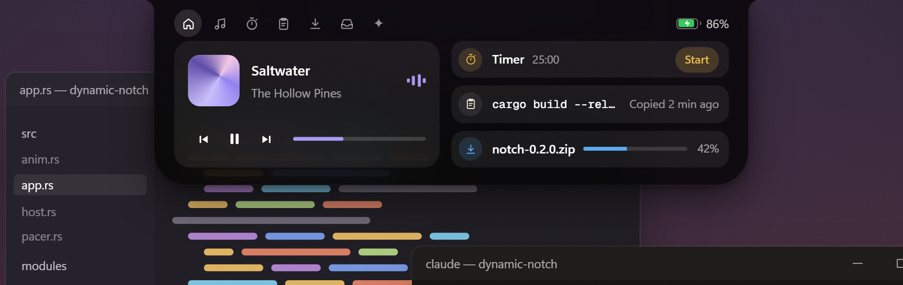
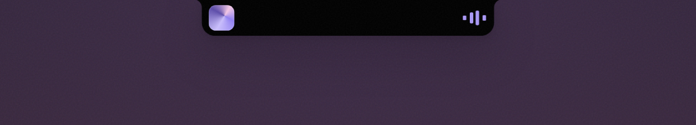
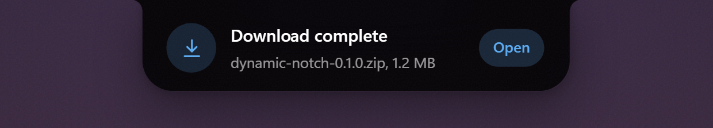
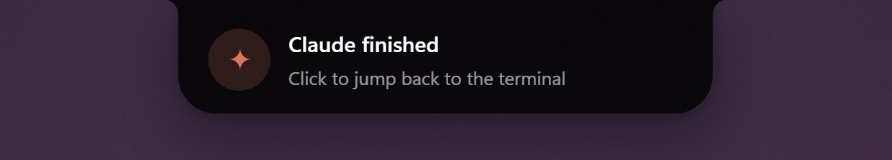

<div align="center">

# Dynamic Notch

**The notch Windows never had.**

A small black island at the top of your screen for music, timers, downloads, dictation and AI.
It grows when something happens and gets out of the way when nothing does.

[](https://github.com/eigenes/DynamicNotch/actions/workflows/ci.yml)
[](https://github.com/eigenes/DynamicNotch/releases/latest)
[](https://github.com/eigenes/DynamicNotch/releases)
[](LICENSE)


[**Download**](https://github.com/eigenes/DynamicNotch/releases/latest) · [Website and live demo](https://eigenes.github.io/DynamicNotch/) · [Changelog](CHANGELOG.md) · [Report a bug](https://github.com/eigenes/DynamicNotch/issues/new/choose)



</div>

<table>
  <tr>
    <td></td>
    <td></td>
    <td></td>
  </tr>
  <tr>
    <td align="center"><sub>Live activities</sub></td>
    <td align="center"><sub>Peeks</sub></td>
    <td align="center"><sub>Claude Code hook</sub></td>
  </tr>
</table>

<sub>Screenshots are taken from the interactive demo on the <a href="https://eigenes.github.io/DynamicNotch/">website</a>, which mirrors the app's layout and animations.</sub>

## Contents

- [How it works](#how-it-works)
- [Modules](#modules)
- [Install](#install)
- [Hotkeys](#hotkeys)
- [Configuration](#configuration)
- [AI and dictation keys](#ai-and-dictation-keys)
- [Scripting](#scripting)
- [Claude Code hook](#claude-code-hook)
- [Performance](#performance)
- [Privacy](#privacy)
- [Building from source](#building-from-source)
- [Troubleshooting](#troubleshooting)

## How it works

The notch has four sizes and moves between them with spring physics.

1. **Rests.** A 188 × 32 px notch at the top of your monitor. Hover it and it leans toward your cursor. It hides for fullscreen games, videos and presentations.
2. **Lives.** When music plays or a timer runs, the notch widens just enough to show it: album art and a visualizer, or a countdown ring. A second live activity gets its own bubble.
3. **Peeks.** Events slide out for about three seconds: a finished download, a plugged-in charger, Caps Lock, a new track. Click a peek to open what it's about.
4. **Opens.** Hover, click or press <kbd>Ctrl</kbd>+<kbd>Alt</kbd>+<kbd>N</kbd> for the full panel on frosted glass. It closes as soon as your mouse leaves.

## Modules

Each module is a single Rust file that sleeps until Windows tells it something changed. Turn any of them off from the tray menu or in the config.

| Module | What it does | Built on |
| --- | --- | --- |
| **Media** | Artwork, title and controls for whatever is playing. The visualizer takes its color from the album art. | System Media Transport Controls |
| **Timer** | Timers and a stopwatch, with a countdown ring in the notch and a chime when done. | Ticks only while running |
| **Downloads** | Browser downloads with size and speed, and a peek when they finish. Open the file or its folder. | `ReadDirectoryChangesW` |
| **Clipboard** | Your recent copies: text, links, files and images. Click one to copy it again. | Memory only, skips password managers |
| **Shelf** | Drop files on the notch to park them, then drag them out into any folder or app later. | OLE drag and drop |
| **Dictation** | Hold <kbd>Ctrl</kbd>+<kbd>Alt</kbd>+<kbd>D</kbd> and speak. The text is typed into the app you were using. | WASAPI capture, Whisper on Groq |
| **Ask AI** | A quick prompt with streamed answers and follow-ups. | OpenRouter, any model |
| **Mic & Camera** | A dot whenever an app uses your microphone or camera, and a peek naming it. | Capability consent store |
| **Dev Servers** | Local dev servers on localhost as they start, each with an Open button. | TCP listener table |
| **Lock Keys** | A short peek when Caps Lock, Num Lock or Scroll Lock changes. | Raw keyboard input |
| **Battery** | Level and charging state in the header, with peeks for plugged in, unplugged, low and full. | `WM_POWERBROADCAST` |
| **Volume & Brightness** | Replaces the Windows volume flyout with a notch peek; brightness changes on the built-in display peek too. | `IAudioEndpointVolume`, WMI |
| **Bluetooth** | Connect and disconnect peeks with the device's battery level, plus a low-battery warning. | `DeviceWatcher`, GATT Battery Service |
| **System Stats** | CPU, RAM and GPU load on the home page, sampled only while the notch is open. | `GetSystemTimes`, PDH GPU counters |
| **Claude Code** | Tells you when Claude finishes or needs you. Click the peek to bring its terminal back. | Stop and Notification hooks |

## Install

1. Download the zip for your PC from the [latest release](https://github.com/eigenes/DynamicNotch/releases/latest):
   - `windows-x64` for most Intel and AMD PCs
   - `windows-arm64` for Snapdragon and other Windows on ARM PCs
2. Unzip it anywhere and run `dynamic-notch.exe`. There is no installer and no runtime to install.
3. Right-click the notch or the tray icon to pick modules and a monitor, and to turn on **Start with Windows**.

The exe isn't code-signed yet, so SmartScreen may warn the first time you run it. Choose **More info → Run anyway**.

**Requirements:** Windows 10 version 1903 or later. Windows 11 is recommended for the frosted glass.

To update, quit the notch from the tray and replace the exe. Your settings live in `%APPDATA%\DynamicNotch` and are kept.

## Hotkeys

| Shortcut | Action |
| --- | --- |
| <kbd>Ctrl</kbd>+<kbd>Alt</kbd>+<kbd>N</kbd> | Open or close the notch |
| <kbd>Ctrl</kbd>+<kbd>Alt</kbd>+<kbd>Space</kbd> | Ask AI |
| <kbd>Ctrl</kbd>+<kbd>Alt</kbd>+<kbd>D</kbd> | Dictate: tap to start and stop, or hold to talk |
| <kbd>Ctrl</kbd>+<kbd>Alt</kbd>+<kbd>T</kbd> | Timer |
| <kbd>Ctrl</kbd>+<kbd>Alt</kbd>+<kbd>V</kbd> | Clipboard history |
| Volume keys | Volume peek instead of the Windows flyout |

Every shortcut can be changed or turned off in the `[hotkeys]` section of the config. Play/pause has no default shortcut.

## Configuration

Settings live in `%APPDATA%\DynamicNotch\config.toml`, which is created with comments on first start. Changes apply as soon as you save the file. Open it from the tray with **Edit settings…**.

```toml
[general]
monitor = "primary"        # "primary", "active" (follow the focused window) or 1, 2, ...
expand_on_hover = true
idle_style = "notch"       # "notch", "pill" (slim line when idle) or "hidden"
hide_in_fullscreen = true

[appearance]
blur = true
bounce = 0.3               # 0 = no overshoot ... 1 = very bouncy
accent = "auto"            # from the album art, or "#RRGGBB"
scale = 1.0

[hotkeys]
toggle = "Ctrl+Alt+N"
ai = "Ctrl+Alt+Space"
dictate = "Ctrl+Alt+D"

[modules]
bluetooth = true           # every module can be switched off here

[ai]
model = "google/gemini-3.1-flash-lite"   # any OpenRouter model id
```

Every key is optional. A missing or invalid value falls back to its default, and the [full default config](src/config.rs) documents each option.

## AI and dictation keys

Ask AI and dictation are optional; everything else works without a key. They read their keys from the environment or from a `.env` file, never from `config.toml`:

```ini
# Ask AI: https://openrouter.ai/keys
OPENROUTER_API_KEY=sk-or-...
# Dictation: https://console.groq.com/keys
GROQ_API_KEY=gsk_...
```

Copy `.env.example` from the zip to `.env` and fill in your keys. The notch looks for `.env` in this order:

1. the process environment
2. next to `dynamic-notch.exe`, then up to three parent folders
3. the current working directory
4. `%APPDATA%\DynamicNotch\.env`

## Scripting

Run the exe again while the notch is running and it hands the command to the running notch. Put it at the end of a build, a render or a backup.

```powershell
dynamic-notch notify "Build finished" "All 112 tests passed"
dynamic-notch progress "Rendering" 42          # 0-100, then "done" or "cancel"
dynamic-notch timer 25                          # start a 25 minute timer, 0 resets
dynamic-notch ask "convert 72F to C"            # ask the AI
dynamic-notch expand timer                      # open the notch on a tab
dynamic-notch toggle | expand | collapse | ai | reload | quit
```

Run `dynamic-notch --help` for the full list.

## Claude Code hook

Add `dynamic-notch claude` as a `Stop` and `Notification` hook in your Claude Code settings (`~/.claude/settings.json`). The exe needs to be on your `PATH`, or use its full path.

```json
{
  "hooks": {
    "Stop": [{ "hooks": [{ "type": "command", "command": "dynamic-notch claude" }] }],
    "Notification": [{ "hooks": [{ "type": "command", "command": "dynamic-notch claude" }] }]
  }
}
```

It stays quiet while you're looking at the terminal Claude runs in, and peeks when you're not. Clicking the peek brings that terminal to the front. Add `--always` to peek even when the terminal is focused. The hook never starts the notch, so it returns immediately when the notch isn't running.

## Performance

Dynamic Notch is written in Rust directly on the Windows compositor. Nothing is drawn unless something changes, and the music visualizer is animated by the compositor itself, so playback costs no CPU either.

| | |
| --- | --- |
| Idle CPU | 0 ms per 10 s |
| Memory | about 25 MB private, idle |
| Download | about 1.5 MB, no runtime needed |
| Startup | 0.35 s to first frame |

<sub>Measured on an ARM64 laptop at 4K and 150% scaling, release build.</sub>

## Privacy

- No telemetry, no accounts, no update checks.
- Clipboard history is kept in memory only and cleared when you quit. Content that password managers mark as sensitive is never read.
- Data leaves your PC only when you use AI or dictation: your prompt goes to OpenRouter, and your recording (plus the optional clean-up pass) goes to Groq.
- API keys are never written to the config or the log.

## Building from source

You need [Rust](https://rustup.rs) (stable) and the MSVC build tools (Visual Studio Build Tools with "Desktop development with C++").

```powershell
git clone https://github.com/eigenes/DynamicNotch.git
cd DynamicNotch
cargo build --release
.\target\release\dynamic-notch.exe
```

Debug builds keep a console window open for log output. To build for the other architecture, add its target first:

```powershell
rustup target add aarch64-pc-windows-msvc   # or x86_64-pc-windows-msvc
cargo build --release --target aarch64-pc-windows-msvc
```

Before opening a pull request, run the same checks as CI:

```powershell
cargo fmt --check
cargo clippy --all-targets -- -D warnings
cargo test
```

### Project layout

```
src/
  main.rs        entry point, single instance, command-line forwarding
  app.rs         notch state machine: modes, peeks, pages, hit testing
  host.rs        Windows.UI.Composition visual tree and backdrop blur
  window.rs      Win32 window plumbing and message loop
  anim.rs        spring animations
  pacer.rs       frame pacing: draw only while something moves
  gfx/           Direct2D / DirectWrite drawing, icons, images
  modules/       one file per module
  sys/           Windows helpers: audio, clipboard, drag and drop, HTTP, speech to text
  config.rs      config.toml, defaults and hot reload
  claude.rs      Claude Code hook bridge
site/            the website, deployed to GitHub Pages
```

### Writing a module

A module implements the `Module` trait in [`src/modules/mod.rs`](src/modules/mod.rs) and is added to `modules::all()`. It runs on the UI thread, gets messages from its own worker threads through the `Bus`, and can contribute any of:

- a live activity in the collapsed notch
- status indicators in the header
- peeks
- a card on the home page
- its own tab

Give it a switch in `[modules]` in [`src/config.rs`](src/config.rs) so it can be turned off.

### Releasing

Add a section for the new version to [CHANGELOG.md](CHANGELOG.md), bump `version` in `Cargo.toml`, then tag and push:

```powershell
git tag v0.2.0
git push origin v0.2.0
```

The [release workflow](.github/workflows/release.yml) builds x64 and ARM64 zips, writes checksums and publishes the release with the changelog section as notes.

## Troubleshooting

- **The notch doesn't appear.** It hides while a fullscreen app is in front, and with `idle_style = "hidden"` it only shows on activity. Check the tray menu: **Hide notch** may be on.
- **Ask AI or dictation says the key is missing.** Put the key in a `.env` file in one of the [places listed above](#ai-and-dictation-keys) and try again. The file is read on every request, so no restart is needed.
- **Something else.** The log is at `%APPDATA%\DynamicNotch\notch.log`. Please attach the relevant lines when you [open an issue](https://github.com/eigenes/DynamicNotch/issues/new/choose), and check them for anything private first.

## License

[MIT](LICENSE)
